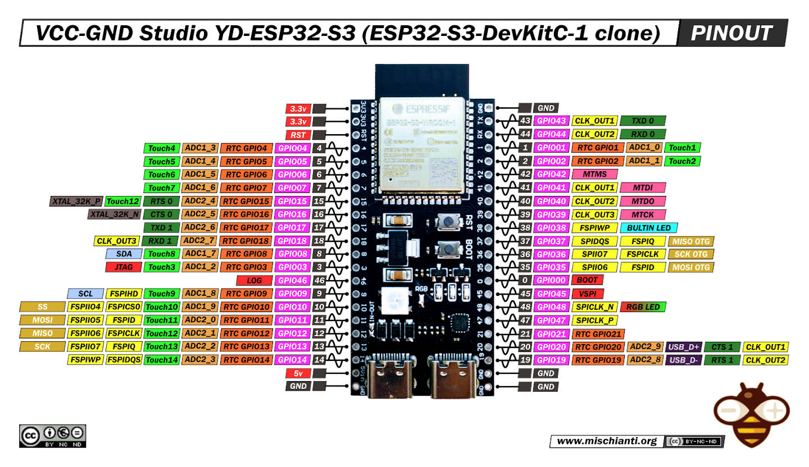
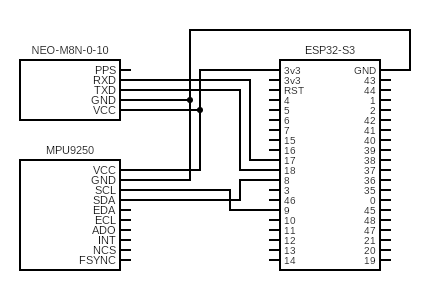
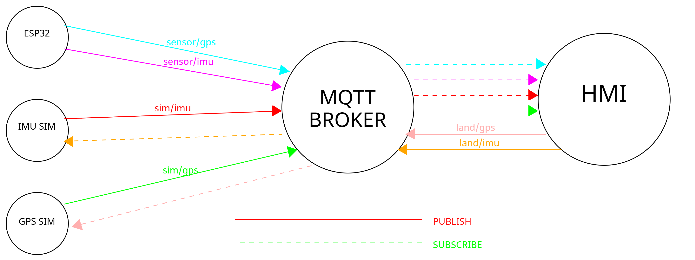

# Digital Twin

This repository contains the Digital Twin of a radio‑controlled replica of the Type 055 destroyer.

The physical replica measures 60.5 × 9.5 × 17 cm and is equipped with an ESP32 microcontroller connected to two primary sensors:
- MPU9250, which provides the vessel’s attitude and heading.
- GPS NEO‑M8N‑0‑10, which provides its position.

The Digital Twin includes simulators for each component (MPU9250 and NEO‑M8N‑0‑10) that can replicate their behavior and be combined with real sensor data.

## Features
- Web interface composed of configurable panels:
    - 3D Model
    - GPS View
    - System Status
    - Sensor Data
    - Widgets View
    - Simulation Manager
    - Recording Manager
    - Routes Manager
    - Current Route View
    - Radar View
- MQTT‑based communication (Mosquitto).
- MQTT recorder with replay capability.
- Containerized sensor simulators.
- Combined ingestion of real and simulated data.

3D Model source: <https://sketchfab.com/3d-models/type-055-renhai-class-destroyer-free-c0a3c5cb49fd4b688b65e4f3a18b5917>


## Panels

### 3D Model
3D viewer of the Type 055 replica. Displays real‑time roll/pitch/yaw motion from the MPU9250. Each axis can be locked to isolate the motion.

### GPS View
Map view showing current position/orientation and trail. Current route’s waypoints can be toggled and latitude/longitude can be copied at the mouse cursor via right‑click.

### System Status
Overview of system components:
- General
    - Connection State (Not initialized, Initializing, OK, Degraded, Simulation, Unavailable)
    - Mode (Manual, Auto, Route)
    - Latency
    - Uptime
- Sensors
    - IMU (Not initialized, Running, Degraded, Simulated, Unavailable)
    - GPS (Not initialized, Running, Degraded, Simulated, Unavailable)
- Others
    - Current time
    - Wi‑Fi Signal (Unavailable, Poor, Medium, High, Excellent)
    - Main Battery (ESP32 remaining battery percentage)
    - Engine Battery (Boat remaining battery percentage)
- GPS
    - Estimated Quality
    - Fix
    - Satellites Used
    - Precision

### Sensor Data
Table with raw and derived readings for quick verification of ranges, units, and signal quality. Includes IMU values and GPS values.

### Widgets View
Compact indicators (e.g., heading vs COG and speed) for quick supervision.

### Simulation Manager
Control the simulators directly from the HMI.
- IMU: start/stop and adjust sea state (amplitude, frequency and spikes), which affects attitude and heading perturbations.
- GPS: set position, heading and speed to start VECTOR motion; or follow ROUTE waypoints defined by the user.

### Recording Manager
Recorder and replayer for MQTT telemetry. Start, pause/resume, and stop recordings, and replay them preserving original timing. Recordings are stored as JSON under `shared/recordings/`.

### Routes Manager
Route editor (ordered list of lat/lon waypoints). Create, rename, save and delete routes (up to 10 points), normalizing coordinates and formatting to 15 decimals. Routes are stored locally in the browser.

### Current Route View
Select and activate a route, showing step‑by‑step progress. Highlights the target waypoint and the remaining distance to reach it.


## Quick start

Start the full system with:

```bash
docker compose up --build
```

The HMI will be available at <http://localhost:3000>.


## Components

### ESP32‑S3 N16R8
This microcontroller acts as a multiplexor between sensors and the ground station (backend), receiving real sensor data via I²C and UART.

<p align="center"></p>

### MPU9250
Inertial sensor combining accelerometer, gyroscope, and magnetometer, providing real‑time orientation estimation.

### NEO‑M8N‑0‑10
GPS receiver that provides position, speed, and signal‑quality metrics.

### Connections
- MPU9250
    - VCC -> ESP32 3v3
    - GND -> ESP32 GND
    - SCL -> ESP32 pin 9 (SCL)
    - SDA -> ESP32 pin 8 (SDA)
- NEO‑M8N‑0‑10
    - VCC -> ESP32 3v3
    - GND -> ESP32 GND
    - TXD -> ESP32 pin 18 (RXD 1)
    - RXD -> ESP32 pin 17 (TXD 1)

<p align="center"></p>


## Simulators

Simulators can be controlled from the HMI’s Simulation Manager panel. Simulator messages take precedence over physical sensor messages: when a simulator is active, its corresponding real sensor data is ignored.

### MPU9250
Publishes periodic IMU telemetry via MQTT. It replicates attitude changes (pitch, roll, yaw) according to the selected sea state (calm, choppy, moderate, rough, storm). Each sub‑sensor (accelerometer, gyroscope, magnetometer) can be configured independently.

### NEO‑M8N‑0‑10
Publishes GPS position, speed and signal‑quality metadata via MQTT. It can emulate vector motion or follow user‑defined routes.


## MQTT Messages

| Topic         | Publisher     | Subscriber    | QoS | Description            |
|---------------|---------------|---------------|-----|------------------------|
| land/imu      | Land Station  | IMU Simulator |  0  | IMU simulation control |
| land/gps      | Land Station  | GPS Simulator |  0  | GPS simulation control |
| sim/imu       | IMU Simulator | Land Station  |  0  | Simulated IMU values   |
| sim/gps       | GPS Simulator | Land Station  |  0  | Simulated GPS values   |
| sensor/imu    | ESP32         | Land Station  |  0  | Real IMU values        |
| sensor/gps    | ESP32         | Land Station  |  1  | Real GPS values        |
| sensor/status | ESP32         | Land Station  |  0  | ESP32 status           |

### land/imu — IMU simulation control
- amp (number, degrees, required): maximum roll/pitch amplitude.
- freq (number, Hz, required): sea‑state frequency.
- spike_prob (number, 0–1, required): probability of brief spikes per sample.
- spike_amp (number, degrees, required): spike amplitude.
- heading (number, degrees, required): base heading. Values < 0 disable yaw simulation.
- control (string, required): "START" to start, "STOP" to stop. Messages without START/STOP are accepted to live‑update parameters.

### land/gps — GPS simulation control
- control (string, required): "VECTOR" or "ROUTE" to start, "STOP" to stop.
- lat (number, degrees, required): initial latitude.
- lon (number, degrees, required): initial longitude.
- spd (number, m/s, required): linear speed.
- hdg (number, degrees, required in VECTOR): heading to maintain.
- next_lat (number, degrees, required in ROUTE): next waypoint latitude.
- next_lon (number, degrees, required in ROUTE): next waypoint longitude.

### sim/imu — Simulated IMU values
- ax (number, g, required): X acceleration (forward positive).
- ay (number, g, required): Y acceleration (port positive).
- az (number, g, required): Z acceleration (up positive).
- gx (number, °/s, required): X angular rate (roll rate).
- gy (number, °/s, required): Y angular rate (pitch rate).
- gz (number, °/s, required): Z angular rate (yaw rate).
- ts (string, ISO‑8601 UTC, required): sampling timestamp.
- seq (integer, required): simulator sequence counter.

### sim/gps — Simulated GPS values
- lat (number, degrees, required): latitude.
- lon (number, degrees, required): longitude.
- alt (number, meters, optional): altitude.
- speed (number, knots, optional): speed over ground.
- fix (integer, optional): fix quality (e.g., 0=no fix, 1=GNSS).
- hdop (number, optional): Horizontal Dilution of Precision.
- sats_used (integer, optional): satellites used.
- sats_in_view (integer, optional): satellites in view.
- cog (number, degrees, optional): course over ground.
- heading (number, degrees, optional): simulator reference heading.
- ts (string, ISO‑8601 UTC, required): sampling timestamp.

### sensor/imu — Real IMU values (ESP32)
- ax (number, m/s², required): X acceleration.
- ay (number, m/s², required): Y acceleration.
- az (number, m/s², required): Z acceleration.
- gx (number, °/s, required): X angular rate.
- gy (number, °/s, required): Y angular rate.
- gz (number, °/s, required): Z angular rate.
- mx (number, µT, required): calibrated magnetic field X.
- my (number, µT, required): calibrated magnetic field Y.
- mz (number, µT, required): calibrated magnetic field Z.
- heading (number, radians, optional): onboard fused heading.
- roll (number, radians, optional): roll estimate.
- pitch (number, radians, optional): pitch estimate.
- rate_hz (number, Hz, optional): publish cadence (typically 100).
- ts (string, ISO‑8601 UTC, required): sampling timestamp.
- seq (integer, required): local sequence counter.

### sensor/gps — Real GPS values (ESP32)
- lat (number, degrees, required): latitude.
- lon (number, degrees, required): longitude.
- alt (number, meters, optional): altitude.
- speed (number, knots, optional): speed over ground.
- cog (number, degrees, optional): course/heading over ground.
- heading (number, degrees, optional): heading from source, if available.
- fix (integer, required): fix quality (0=no fix, 1=GNSS).
- hdop (number, required): solution HDOP.
- sats_used (integer, required): satellites used.
- ts (string, ISO‑8601 UTC, required): sampling timestamp.

### sensor/status — ESP32 status
- ts (string, ISO‑8601 UTC, required): timestamp.
- wifi_rssi (integer, dBm, optional): Wi‑Fi signal strength.
- wifi_quality (string, optional): Unavailable | Poor | Medium | High | Excellent.

<p align="center"></p>

